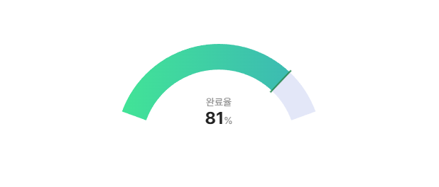

# Arc Chart



Chart.js 기반의 아크(arc) 형태 게이지 컴포넌트입니다.

- 진행률(0~1) 표시
- 임계값 기준 warning / normal / success 색상 자동 전환
- 시작색 / 끝색 / 바(bar) 색상 커스터마이징
- 중앙 라벨 / 퍼센트 표시 on/off
- 애니메이션 on/off 및 설정
- 런타임 업데이트 API 제공

## 설치

```bash
npm install arc-chart chart.js
```

`chart.js`는 peer dependency입니다.

## 빠른 시작

```html
<canvas id="mainChart"></canvas>
```

```js
import ArcChart from "arc-chart";
import "arc-chart/dist/arc-chart.css";

const chart = new ArcChart("#chart", {
	value: 0.25,
	label: "완료율",
	showLabel: true,
	showPercentage: true,
	animation: true,
	gapDegree: 220,
	cutout: "75%",
	thresholds: {
		warning: 0.3,
		success: 0.8,
	},
	trackColor: "#E3E7F8",
	colors: {
		warning: { start: "#FF8E53", end: "#FF5F1F", bar: "#FF4500" },
		normal: { start: "#556DFF", end: "#2F4CFF", bar: "#1233FF" },
		success: { start: "#42E695", end: "#3BB2B8", bar: "#2E8B57" },
	},
});
```

## 옵션

| 옵션 | 타입 | 기본값 | 설명 |
| --- | --- | --- | --- |
| value | number | 0 | 진행률 값 (0~1) |
| label | string | "" | 중앙 라벨 텍스트 |
| showLabel | boolean | true | 중앙 라벨 표시 여부 |
| showPercentage | boolean | true | 중앙 퍼센트 표시 여부 |
| gapDegree | number | 220 | 비어 있는 각도(0~300 권장) |
| cutout | string | "75%" | 도넛 두께 비율 |
| thresholds.warning | number | 0.3 | warning 기준(미만) |
| thresholds.success | number | 0.8 | success 기준(이상) |
| trackColor | string | "#E3E7F8" | 배경 트랙 색상 |
| colors.warning.start/end/bar | string | "#FF8E53 / #FF5F1F / #FF4500" | warning 상태 색상 |
| colors.normal.start/end/bar | string | "#556DFF / #2F4CFF / #1233FF" | normal 상태 색상 |
| colors.success.start/end/bar | string | "#42E695 / #3BB2B8 / #2E8B57" | success 상태 색상 |
| animation | boolean \| object | true | `false`면 비활성화, 객체면 Chart.js animation 옵션 일부 반영 |

### 상태 판정 규칙

- `value < thresholds.warning` -> warning
- `value >= thresholds.success` -> success
- 그 외 -> normal

## 런타임 API

### updateValue(newValue)

값만 빠르게 업데이트합니다.

```js
chart.updateValue(0.67);
```

### updateOptions(newOptions)

옵션을 부분 업데이트합니다.

```js
chart.updateOptions({
	label: "진행도",
	showLabel: true,
	showPercentage: false,
	animation: false,
	gapDegree: 180,
	cutout: "70%",
	trackColor: "#222",
	thresholds: { warning: 0.2, success: 0.9 },
	colors: {
		normal: { start: "#4A6CFA", end: "#1C40F2", bar: "#0E2BD9" },
	},
});
```

`colors`, `thresholds`는 부분 병합(merge)됩니다.

## 개발

```bash
npm install
npm run dev
```

- `npm run dev`: Rollup watch 빌드
- `npm run build`: 배포용 dist 생성

## 데모

`docs/index.html`에 인터랙티브 데모가 포함되어 있습니다.

데모는 `dist/arc-chart.js`를 사용하므로, 소스 수정 후에는 `npm run build`로 dist를 갱신해 주세요.
